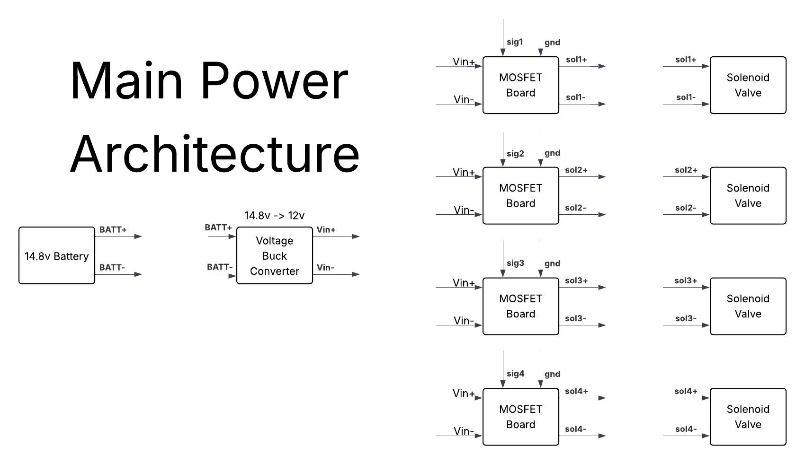
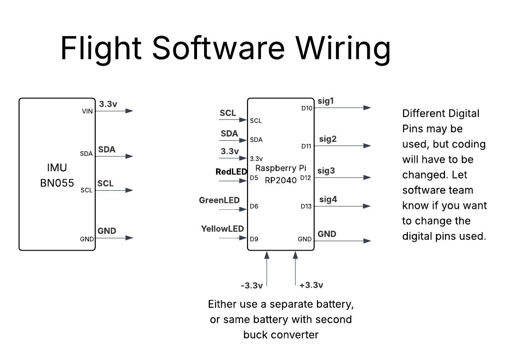

# Purdue Orbital GNC -- Polaris Program Documentation

## Overview
This program controls the attitude of a launch structure using thrusters and an inertial measurement unit (IMU) sensor BNO055. It implements a PID control loop to maintain a desired heading (orientation) and logs telemetry data to an SD card. The program also manages status LEDs and thruster actuation using digital I/O pins.

---

## Hardware Inputs and Pinout

| Name              | Pin        | Description                                    |
|-------------------|------------|------------------------------------------------|
| SCL               | IMU SCL    | I2C clock line for BNO055 IMU                   |
| SDA               | IMU SDA    | I2C data line for BNO055 IMU                     |
| 3.3V              | VIN on IMU | Power supply for the IMU                         |
| D5                | GPIO D5    | Yellow LED (flashes during countdown)           |
| D6                | GPIO D6    | Green LED (blinks while running)                 |
| D9                | GPIO D9    | Red LED (blinks on error/failure)                |
| D10               | Thruster L | Left thruster control (not currently used)       |
| D11               | Thruster R | Right thruster control (not currently used)      |
| D12               | Thruster 3 | Thruster control (connected to positive thruster) |
| D13               | Thruster 4 | Thruster control (connected to negative thruster) |
| GND               | Ground     | Common ground for LEDs, IMU, and MOSFETs         |
| SD Card CS        | board.SD_CS| Chip select pin for SD card SPI interface         |
| SD Card CLK       | board.SD_CLK| SPI clock for SD card                              |
| SD Card MOSI      | board.SD_MOSI| SPI MOSI for SD card                              |
| SD Card MISO      | board.SD_MISO| SPI MISO for SD card                              |

## Main Power Architecture

The power system starts with a 14.8V battery, which is stepped down to 12V via a buck converter. Each MOSFET board receives switched 12V power and output signals to individual solenoid valves, enabling safe control of thrusters. This modular design allows independent activation of thrusters and easy troubleshooting.

---

## Flight Software Wiring

This schematic shows how the IMU (BNO055) connects via I2C (SCL, SDA, 3.3V, GND) to the Raspberry Pi RP2040 microcontroller. The RP2040 directs LED status signals and outputs digital thruster control pins (sig1–sig4) to the MOSFET boards, interfacing each with its corresponding solenoid valve. Separate or buck-converted power ensures safe operation of logic and actuators.
:w

---
**Thruster Notes:**
- Thruster 1 and 3 impart negative torque on the structure.
- Thruster 2 and 4 impart positive torque.
- Current thruster firing only uses left/right thrusters (D12 and D13 pins).
- Thrusters are controlled through MOSFETs connected to these GPIO pins.

---

## Functions

### `temperature()`
Reads and filters the temperature from the BNO055 IMU sensor. Checks for a specific error condition with the sensor and returns a corrected temperature value.

### `get_current_heading()`
Reads the current heading in degrees from the IMU sensor's Euler angle output.

---

## How It Works

### Initialization
- LEDs and thruster control pins are initialized as digital outputs.
- The program performs a 5-step countdown indicated by flashing the yellow LED.
- The SD card is initialized and a new CSV log file is created with a timestamped filename.
- I2C communication is started with the BNO055 IMU sensor.
- Status variables and PID constants are set up.

### Main Control Loop
- The program continuously reads the current heading from the IMU.
- It calculates the error between the desired heading (setpoint = 0°, North) and the current heading, accounting for angle wraparound (handling 0° = 360°).
- Time elapsed between loop iterations is calculated for derivative computations.
- A low-pass filter smooths the derivative of error to reduce noise.
- PID output is computed using proportional (Kp) and derivative (Kd) gains.
- Based on PID output, one of two thrusters is fired to correct the heading:
  - Positive output fires the negative thruster (right)
  - Negative output fires the positive thruster (left)
- A deadzone threshold prevents thrusters from firing for small errors near zero.
- The green LED blinks continuously to indicate the system is active.
- Telemetry data including time delta, angular position, thruster states, gyro data, and PID values are logged to the SD card.
- Errors during operation cause the red LED to blink indefinitely and print error messages.

### PID Control Details
- Proportional gain \(K_p = 0.56\) and derivative gain \(K_d = 0.45\) are tuned constants for controlling the thrusters.
- The derivative is filtered using a low-pass filter with time constant \(\tau = 0.1\) to reduce sensor noise effects.
- Error is calculated with wrap-around so the heading difference is always within \([-180°, 180°]\).

---

## Status LEDs

| LED Color | Pin | Function                            |
|-----------|-----|-----------------------------------|
| Red       | D9  | Indicates failure/error            |
| Green     | D6  | Blinks to show the program is running |
| Yellow    | D5  | Flashes during countdown before start |

---

## Summary
This software manages an attitude control system with:

- An IMU sensor to read orientation.
- A PID controller to maintain a set heading.
- Thrusters activated through MOSFETs to apply torque.
- Status LEDs to provide feedback on system state.
- Data logging of sensor and control data to an SD card for post-flight analysis.

The implementation focuses on error handling and stable control through filtering and set thresholds in a resource-constrained embedded environment.

---

*Documentation generated for the Purdue Orbital GNC Polaris Program by Adafruit Industries under MIT License.*  

